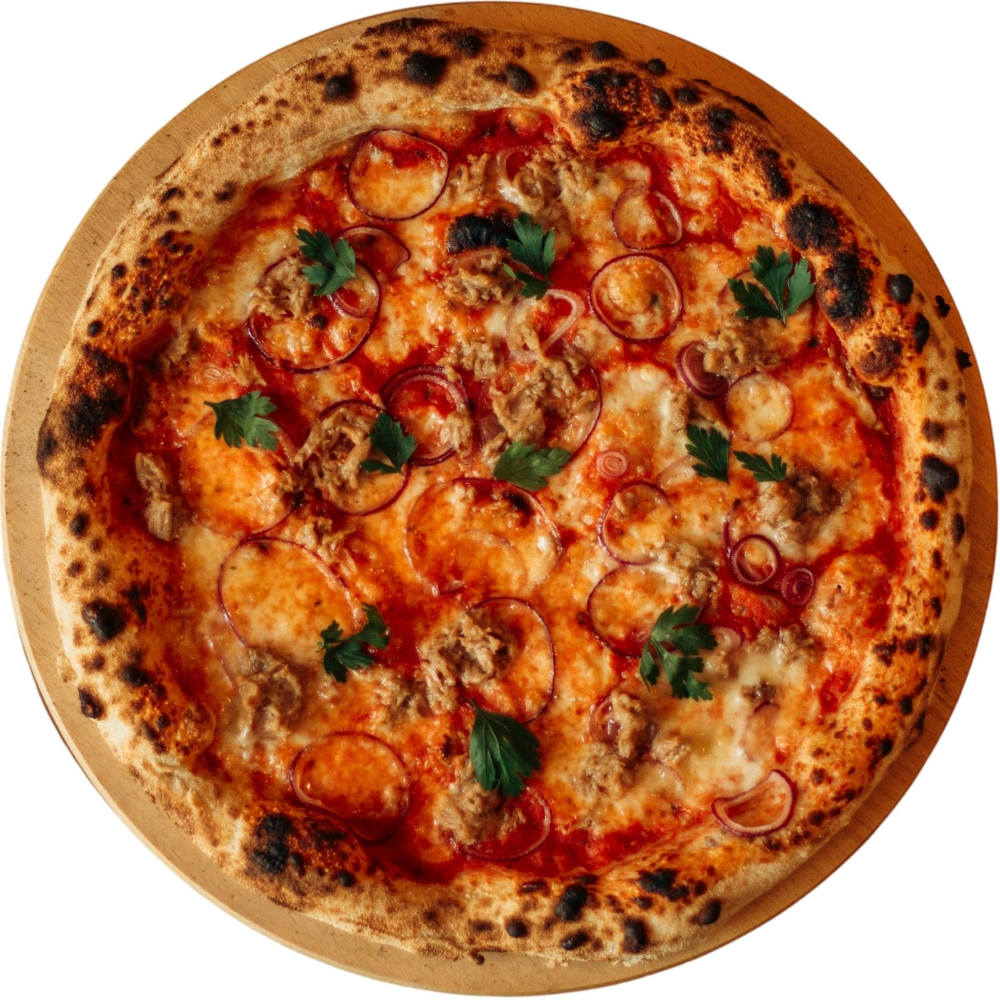

# FUOCO — Wood-Fired Pizza Landing Page

> A high-fidelity restaurant landing page for a fictional Neapolitan pizza brand. Built with vanilla HTML, CSS, and JavaScript — no frameworks, no build tools.

## Live Demo

[fuoco-pizza.vercel.app]([https://fuoco-pizza.vercel.app](https://nzlicrbc.github.io/pizza/))

## Preview



## Features

- Animated loader screen
- GSAP scroll-triggered animations
- Animated pizza delivery route (MotionPath)
- Floating ingredient icons
- Fullscreen image sections
- Responsive navigation with mobile overlay
- Accessible markup (ARIA roles, semantic HTML)

## Tech Stack

| Layer | Detail |
|---|---|
| Markup | HTML5 |
| Styling | CSS3 (custom properties, grid, flexbox) |
| Animation | GSAP 3 + ScrollTrigger + MotionPathPlugin |
| Fonts | Google Fonts — Modak, Mouse Memoirs |
| Assets | Static images (JPG/PNG) |

## Project Structure

```
pizza/
├── index.html
├── css/
│   └── style.css
├── js/
│   ├── script.js
│   └── sticker.min.js
└── images/
```
